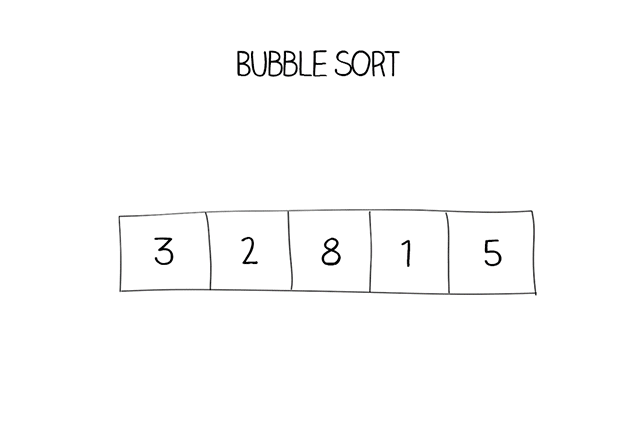

# Bubble Sort

Bubble sort is a simple sorting algorithm that repeatedly steps through the list to be sorted, comparing each pair of adjacent
items and swapping them if they are in the wrong order (ascending or descending arrangement).

The pass through the list is repeated until no swaps are needed, which indicates that the list is sorted.

It is **stable** because a swap cannot cause an element to move past another with the same value

It is **in-place** because no additional data structures are used

## Complexity

| Name                  | Best            | Average             | Worst               | Memory    | Stable    | Comments  |
| --------------------- | :-------------: | :-----------------: | :-----------------: | :-------: | :-------: | :-------- |
| **Bubble sort**       | n               | n2       | n2       | 1         | Yes       |           |

## References

- [Wikipedia](https://en.wikipedia.org/wiki/Bubble_sort)
- [La Vivien Post](https://www.lavivienpost.net/bubble-sort-basic-and-optimized/)